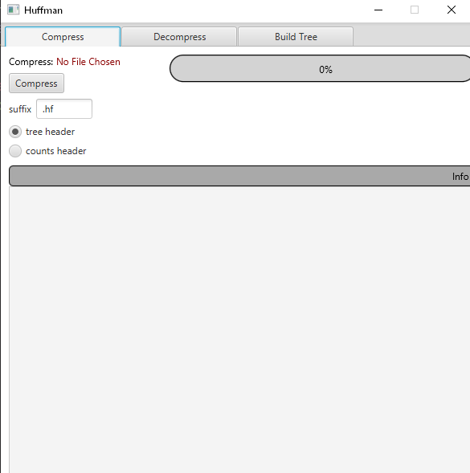
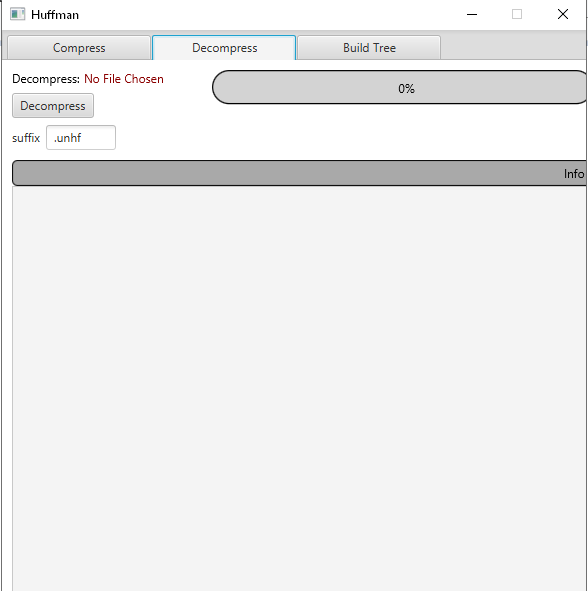
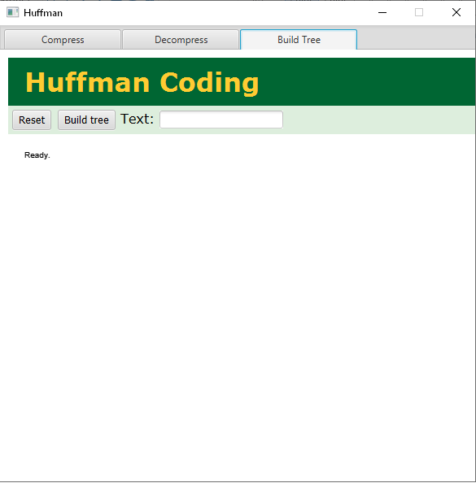

# Huffman Algorithim

This project Implements Huffman Coding Algorithm in Java with GUI.

## Acknowledgments

- Huffman algorithm was taken from https://coursework.cs.duke.edu/201spring17/huff-start and modified to fit the project.

- Huffman algorithm to show the tree was taken from https://people.ok.ubc.ca/ylucet/DS/Huffman.html 

The main effort of the project was to combine the algorithim and add visiuaization to simulate the algorithim behavior.

## Usage

Instructions to Open the program:

1. open the HuffmanMain.jar.
2. The GUI Contains 3 Tabs { Compress, Decompress, Build Tree }

## GUI Interface

The interface has three main tabs namely:

Compress, Decompress, and Build Tree Tab.

In order to use each properly follow the instructions below:

1. Compress Tab
   First, click on "No file Chosen" to choose the file to be compressed. Then, click on compress icon after choosing the file. Then, the slide bar perctange shows the compleition out 100%. Finally, after the slide bar completed 100%, it will show the compression information.

   We provided two samples namely "Shakesperea, melville" in the data folder that can be used.

2. Decompress Tab
    First, click on "No file Chosen" to choose the file to be decompressed. Then, click on decompress icon after choosing the file. Then,the slide bar perctange shows the compleition out 100%
    Finally, after the slide bar completed 100%, it will show the decompression information.

3. Build Tree Tab
    First, insert the text to be displayed.
    finally, click on build tree after inserting the text.

Finally, Enjoy!.

---

*Important to note that the build tree requires internet connection and may take a bit long to open so please be patient.*
